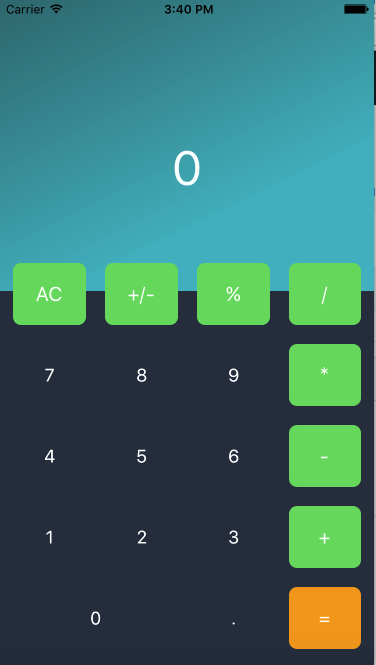
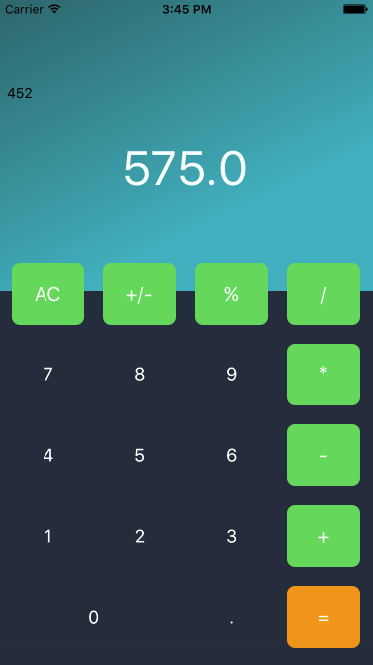

# Máy tính cá nhân đơn giản - Simple Calculator
Mô phỏng lại ứng dụng máy tính cá nhân.

## Nền tảng

IOS > 10.1 

## Ngôn ngữ, công cụ

* Swift 3.0 
* Xcode 8

### Kĩ thuật

* AutoLayout AutoContrains

* Thiết kế giao diện nhiều button 

* Gradient Color

* Giải thuật cơ bản

### Tham khảo
* [Techmaster](https://techmaster.vn/) - Tham khảo thiết kế giao diện.
